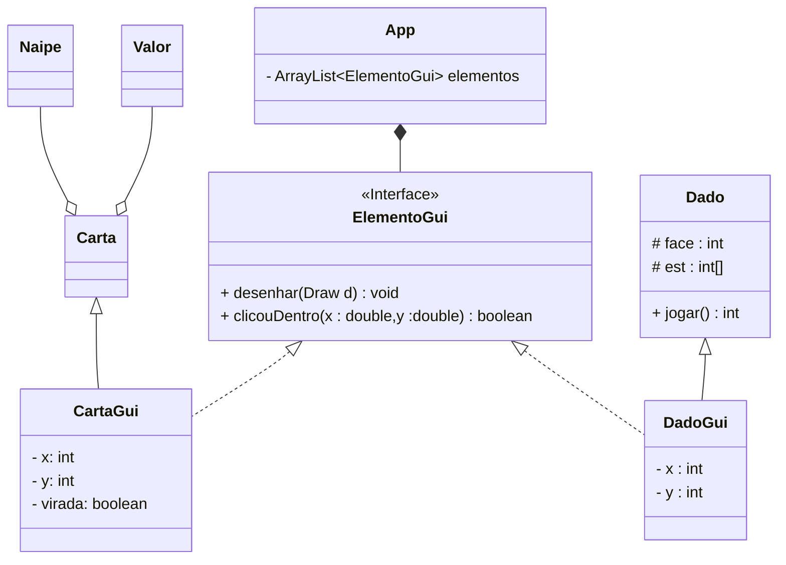

```mermaid
classDiagram
    direction TB

    App *-- ElementoGui
    Carta <|-- CartaGui
    Naipe --o Carta
    Valor --o Carta
    Dado <| -- DadoGui
    
    class App{
        - ArrayList~ElementoGui~ elementos
    }
    
    class Dado{
        # face : int
        # est  : int[]
        + jogar() int
    }
    
    class DadoGui{
        - x : int
        - y : int
    }
    
    class CartaGui{
        - x: int
        - y: int
        - virada: boolean
        
    }
    
    class ElementoGui{
        <<Interface>>
        + desenhar(Draw d) void
        + clicouDentro(x : double,y :double) boolean
    }
    
    ElementoGui <|.. CartaGui
    ElementoGui <|.. DadoGui
```