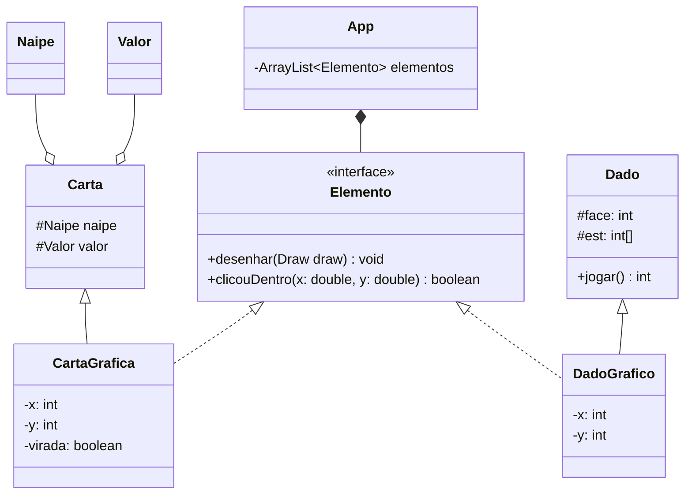

```mermaid
classDiagram
    direction TB
    
    App *-- Elemento
    Carta <|-- CartaGrafica
    Naipe --o Carta
    Valor --o Carta
    Dado <|-- DadoGrafico
    Elemento <|.. CartaGrafica
    Elemento <|.. DadoGrafico
    
    class App {
        -ArrayList~Elemento~ elementos
    }
    
    class Dado {
        #face: int
        #est: int[]
        +jogar() int
    }
    
    class DadoGrafico {
        -x: int
        -y: int
    }
    
    class Carta {
        #Naipe naipe
        #Valor valor
    }
    
    class CartaGrafica {
        -x: int
        -y: int
        -virada: boolean
    }
    class Elemento {
        <<interface>>
        +desenhar(Draw draw)void 
        +clicouDentro(x: double, y: double) boolean
    }

```