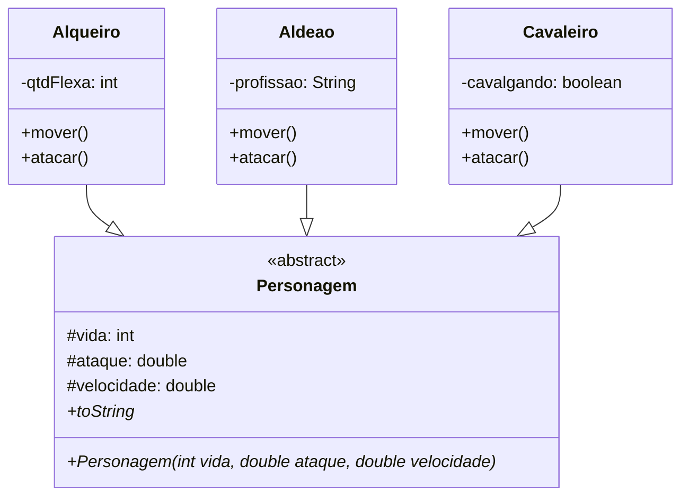

```mermaid

classDiagram
    class Alqueiro {
        -qtdFlexa: int
        +mover()
        +atacar()
    }
    class Cavaleiro {
        -cavalgando: boolean
        +mover()
        +atacar()
    }
    class Aldeao {
        -profissao: String
        +mover()
        +atacar()
    }
    class Personagem {
        <<abstract>>
        #vida: int
        #ataque: double
        #velocidade: double
        +Personagem(int vida, double ataque, double velocidade)*
        +toString*
    }
    Alqueiro --|> Personagem
    Aldeao  --|> Personagem
    Cavaleiro  --|> Personagem
        
        
   
    
```

---