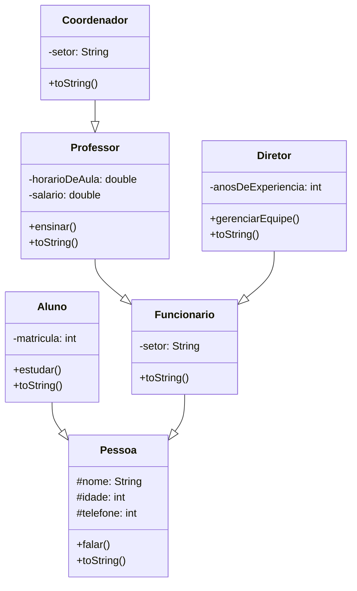
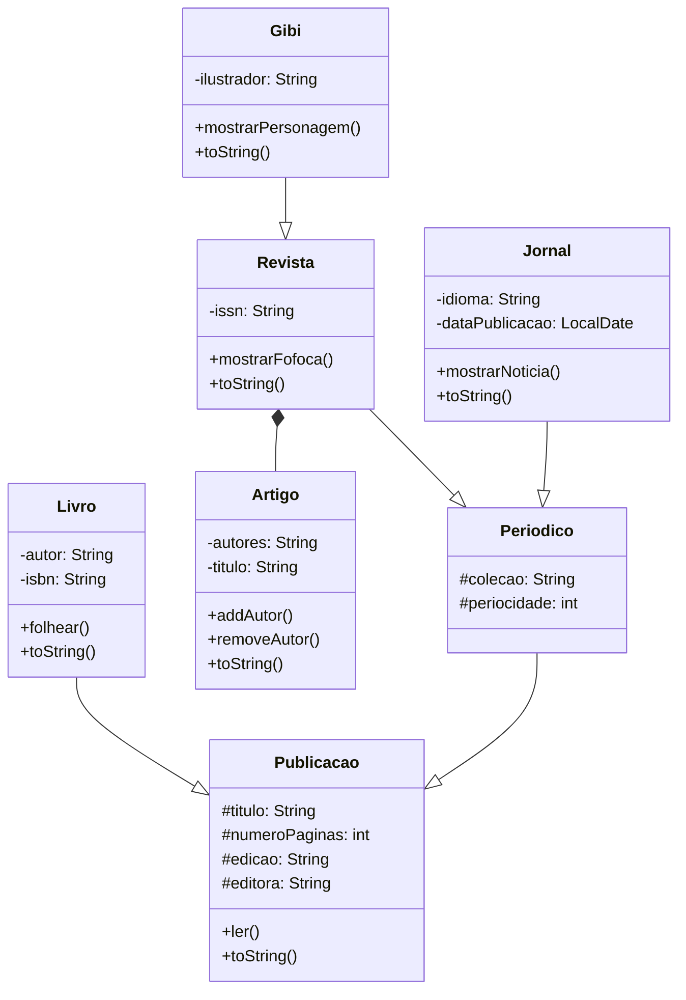
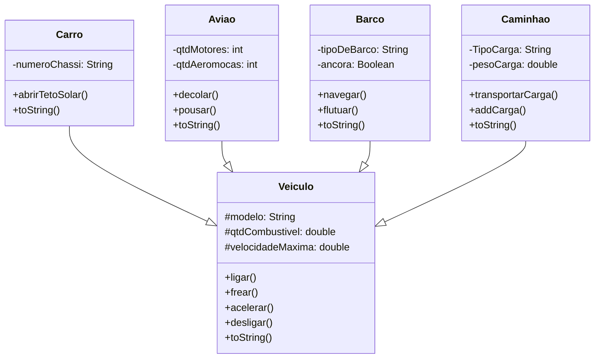
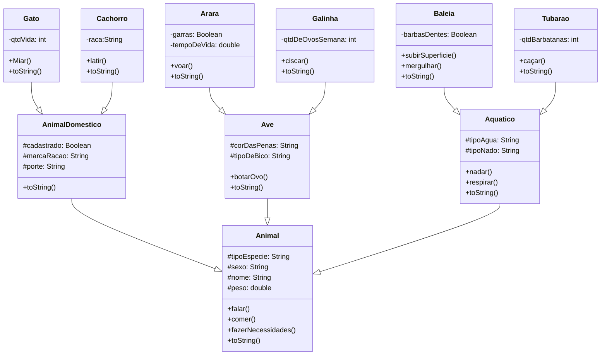

```mermaid


classDiagram
        class Aluno {
            -matricula: int
            +estudar()
            +toString()
        }
        class Professor {
            -horarioDeAula: double
            -salario: double
            +ensinar()
            +toString()
        }
        
        class Coordenador {
            -setor: String
            +toString()
        }
        
        class Diretor {
            -anosDeExperiencia: int
            +gerenciarEquipe()
            +toString()
        }
        class Pessoa {
            #nome: String
            #idade: int
            #telefone: int
            +falar()
            +toString()
            
        }
        class Funcionario {
            -setor: String
            +toString()
        }
    Aluno --|> Pessoa
    Funcionario --|> Pessoa
    Professor --|> Funcionario
    Coordenador --|> Professor
    Diretor --|> Funcionario
    
```
---

```mermaid


classDiagram

    class Livro {
        -autor: String
        -isbn: String
        +folhear()
        +toString()
    }
    class Revista {
        -issn: String
        +mostrarFofoca()
        +toString()
        
    }
    class Jornal {
        -idioma: String
        -dataPublicacao: LocalDate
        +mostrarNoticia()
        +toString()
    }
    
    class Gibi {
        -ilustrador: String
        +mostrarPersonagem()
        +toString()
        
    }
    class Publicacao {
        #titulo: String
        #numeroPaginas: int
        #edicao: String
        #editora: String
        +ler()
        +toString()
    }
    class Artigo {
        -autores: String
        -titulo: String
        +addAutor()
        +removeAutor()
        +toString()
    }
    class Periodico {
        #colecao: String
        #periocidade: int
    }
    
    Livro --|> Publicacao
    Periodico --|> Publicacao
    Jornal --|> Periodico
    Revista --|> Periodico
    Gibi --|> Revista
    Revista *-- Artigo 
```

---

```mermaid


classDiagram
    class Carro {
        -numeroChassi: String
        +abrirTetoSolar()
        +toString()
    }
    class Aviao {
        -qtdMotores: int
        -qtdAeromocas: int
        +decolar()
        +pousar()
        +toString()
    }
    class Barco {
        -tipoDeBarco: String
        -ancora: Boolean
        +navegar()
        +flutuar()
        +toString()
    }
    class Caminhao {
        -TipoCarga: String
        -pesoCarga: double
        +transportarCarga()
        +addCarga()
        +toString()
    }
    class Veiculo {
        #modelo: String
        #qtdCombustivel: double
        #velocidadeMaxima: double
        +ligar()
        +frear()
        +acelerar()
        +desligar()
        +toString()
    }
    
    Carro --|> Veiculo
    Aviao --|> Veiculo
    Barco --|> Veiculo
    Caminhao --|> Veiculo
    
```

---

```mermaid


classDiagram
   class Gato {
       -qtdVida: int
       +Miar()
       +toString()
   }
   class Cachorro {
       -raca:String
       +latir()
       +toString()
   }
   class AnimalDomestico {
       #cadastrado: Boolean
       #marcaRacao: String
       #porte: String
       +toString()
   }
   class Arara {
       -garras: Boolean
       -tempoDeVida: double
       +voar()
       +toString()
   }
   class Galinha {
       -qtdDeOvosSemana: int
       +ciscar()
       +toString()
   }
   class Ave {
       #corDasPenas: String
       #tipoDeBico: String
       +botarOvo()
       +toString()
   }
   class Baleia {
       -barbasDentes: Boolean
       +subirSuperficie()
       +mergulhar()
       +toString()
   }
   class Tubarao {
       -qtdBarbatanas: int
       +caçar()
       +toString()
   }
   class Aquatico {
       #tipoAgua: String
       #tipoNado: String
       +nadar()
       +respirar()
       +toString()

   }
   class Animal {
       #tipoEspecie: String
       #sexo: String
       #nome: String
       #peso: double
       +falar()
       +comer()
       +fazerNecessidades()
       +toString()
   }
   Gato --|> AnimalDomestico
   Cachorro --|> AnimalDomestico
    AnimalDomestico --|> Animal
    
    Arara  --|> Ave
    Galinha --|> Ave
    Ave --|> Animal
    
    Baleia --|> Aquatico
    Tubarao --|> Aquatico
    Aquatico --|> Animal
    
```

---