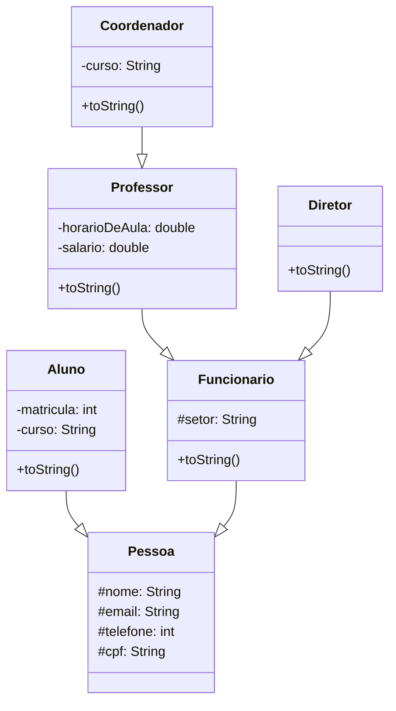
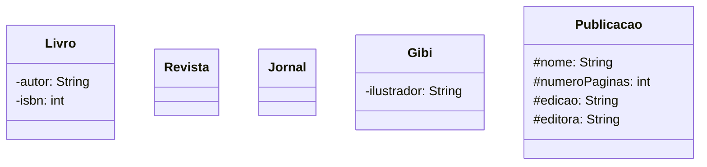

```mermaid


classDiagram

    
        class Aluno {
            -matricula: int
            -curso: String
            +toString()
        }
        
        class Professor {
            -horarioDeAula: double
            -salario: double
            +toString()

        }
        
        class Coordenador {
            -curso: String
            +toString()

        }
        
        class Diretor {
            
            +toString()
        }
        class Pessoa {
            #nome: String
            #email: String
            #telefone: int
            #cpf: String
            
        }
        class Funcionario {
            #setor: String
            +toString()
        }
    Aluno --|> Pessoa
    Professor --|> Funcionario
    Coordenador --|> Professor
    Diretor --|> Funcionario
    Funcionario --|> Pessoa
    
```

```mermaid


classDiagram

    class Livro {
        -autor: String
        -isbn: int


    }
    class Revista {
        
    }
    class Jornal {
        
    }
    
    class Gibi {
        -ilustrador: String
        
    }
    class Publicacao {
        #nome: String
        #numeroPaginas: int
        #edicao: String
        #editora: String
    }
```