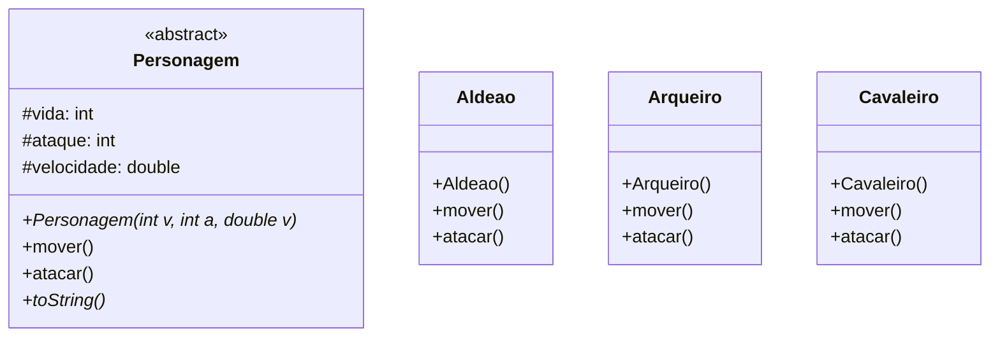

```mermaid

classDiagram
   
    class Personagem {
        <<abstract>>
        #vida: int
        #ataque: int
        #velocidade: double
        +Personagem(int v, int a, double v)*
        +mover()
        +atacar()
        +toString()*
    }
    
    class Aldeao {
        +Aldeao()
        +mover()
        +atacar()
    }
    
    class Arqueiro {
        +Arqueiro()
        +mover()
        +atacar()
    }
    
    class Cavaleiro {
        +Cavaleiro()
        +mover()
        +atacar()
    } 
    
    
    
```