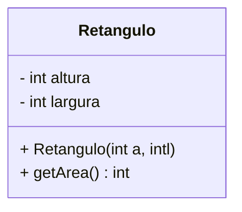
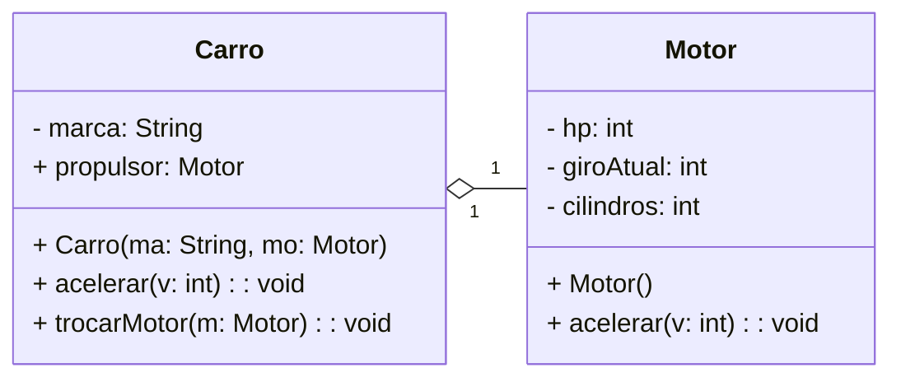
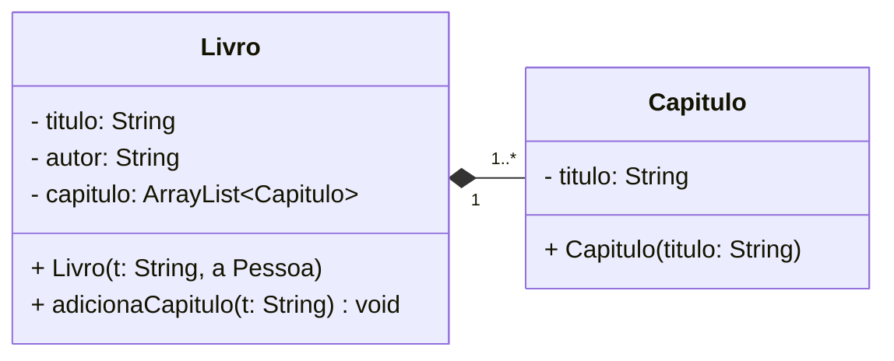
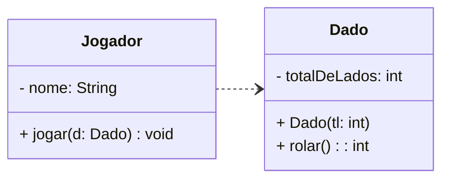
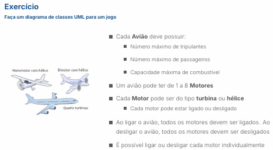
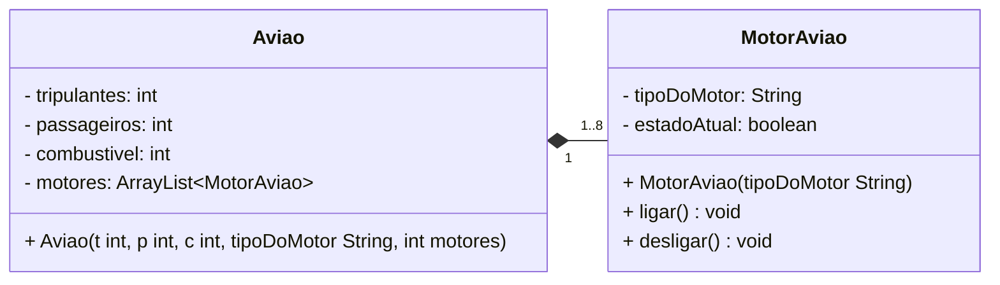

# Diagrama de classe UML


## Cardinalidade (multiplicidade)

- Quantos objetos de uma classe se relacionam com outra 
  - "1"        → exatamente um
  - "0..1"     → zero ou um (opcional)
  - "*"        → muitos (zero ou mais)
  - "0..*"     → zero ou muitos 
  - "1..*"     → um ou muitos (pelo menos um)
  - "n"        → número exato (ex: "3")
  - "n..m"     → intervalo (ex: "2..5")

livro <--> Autor
- Um livro tem 1 autor
- Um autor pode ter vários livros

Livro "1" ----- "1..*" Autor  

- Um livro tem 1 autor
- Um capitulo pertence a um livro 

Livro "1" ----- "1..*" Capitulo
---


## Tipos de Associação 

### Agregação (Toda-parte-fraca)

- "Parte-de" ou "Contém". Simbolo losango vazio na extremidade da classe que contém o Todo.

- Ao criar um objeto da classe Carro, é necessário passar um objeto da classe Motor para o construtor do carro.

- A classe Carro tem uma referência para um objeto da classe Motor.

- Ao destruir um objeto da classe Carro, o objeto da classe Motor pode continuar existindo se houver outras referência para ele.





```java
public class Carro{
    private String marca;
    private Motor propulsor;
    
    public Carro(String m, Motor mo){
        this.marcar = m;
        this.propulsor = mo;
    }
    public void acelerar(int valor){
        this.propulsor.acelerar(valor);
    }
    public void trocarMotor(Motor mo){
        this.propulsor = mo;
    }
}
```
---
### Composição (Pertencimento-forte)

- Relação forte. Simbolo uma linha sólida com um losango preenchido no lado da classe "Todo".

- Classe-todo (mãe) é responsável por crias e destruir os objetos-parte (filhos), ou seja, o ciclo de vida dos objetos-parte é controlado pelo objeto-todo.




```java
import java.util.ArrayList;

public class Livro {
    private String titulo;
    private ArrayList<Capitulo> capitulos;
    private Pessoa autor;

    public Livro(String t, Pessoa a) {
        this.titulo = t;
        this.capitulos = new ArrayList<>();
        this.autor = a;
    }
    // método adicionar capitulo
    public void adicionaCapitulo(String titulo){
        this.capitulos.add(new Capitulo(titulo));
    }
}
```

### Dependência (Temporária)

- Usa sem ter
- Ocorre quando uma classe "A" precisa de uma classe "B" temporariamente.
- Geralmente dentro do escopo de um método, e não como uma variável de instância persistente



---
<p align="center">
    
</p>


