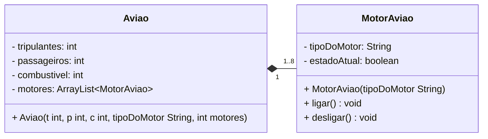

# Diagrama de classe UML

[//]: # (```mermaid)

[//]: # ()
[//]: # (classDiagram)

[//]: # (    )
[//]: # (        class Retangulo{)

[//]: # (            - int altura )

[//]: # (            - int largura)

[//]: # (            + Retangulo&#40;int a, intl&#41;)

[//]: # (            +  getArea&#40;&#41; int)

[//]: # (        })

[//]: # (```)

[//]: # ()
[//]: # (```mermaid)

[//]: # ()
[//]: # (classDiagram)

[//]: # (        direction LR)

[//]: # (        class Carro { )

[//]: # (            - marca: String)

[//]: # (            + propulsor: Motor)

[//]: # (            + Carro&#40;ma: String, mo: Motor&#41;)

[//]: # (            + acelerar&#40;v: int&#41;: void)

[//]: # (            + trocarMotor&#40;m: Motor&#41;: void)

[//]: # (        })

[//]: # (        )
[//]: # (        class Motor {)

[//]: # (            - hp: int)

[//]: # (            - giroAtual: int)

[//]: # (            - cilindros: int)

[//]: # (            + Motor&#40;&#41;)

[//]: # (            + acelerar&#40;v: int&#41;: void)

[//]: # (        })

[//]: # (         Carro "1" o--  "1" Motor)

[//]: # ()
[//]: # (```)


