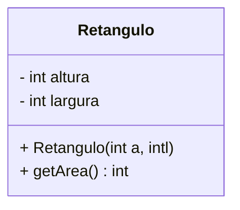
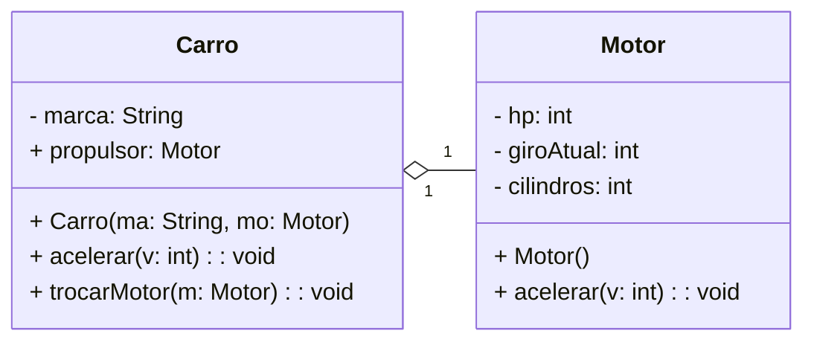

# Diagrama de classe UML

```mermaid

classDiagram
    
        class Retangulo{
            - int altura 
            - int largura
            + Retangulo(int a, intl)
            +  getArea() int
        }
```

```mermaid

classDiagram
        direction LR
        class Carro { 
            - marca: String
            + propulsor: Motor
            + Carro(ma: String, mo: Motor)
            + acelerar(v: int): void
            + trocarMotor(m: Motor): void
        }
        
        class Motor {
            - hp: int
            - giroAtual: int
            - cilindros: int
            + Motor()
            + acelerar(v: int): void
        }
         Carro "1" o--  "1" Motor

```