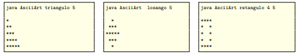

## Laboratório 02: Revisão da linguagem Java

[1. Estacão do Ano](src/main/java/lab02/EstacaoDoAno01.java) - Estação do ano. Faça um programa que leia do teclado um número inteiro que representa o dia, e uma string que representa o mês. Por fim, imprima na tela a estação do ano correspondente aqui no Brasil.

---

[2. Acerte o Número](src/main/java/lab02/AcerteNumero.java) - Acerte o número. Faça um programa que gere um número aleatório entre 1 e 100 e peça para o usuário acertar o número. Se o usuário acertar, o programa deve imprimir “Parabéns, você acertou!” e indicar quantas tentativas foram necessárias para acertar o número. Caso contrário, o programa deve avisar se o número informado é maior ou menor que o número sorteado e pedir para o usuário tentar novamente. O programa deve continuar pedindo para o usuário tentar acertar o número até que ele acerte.

---

[3. ASCII Art.](src/main/java/lab02/AsciiArt.java) - Desenvolva um aplicativo Java que imprima tela, como ASCII art, um triângulo retângulo, um losango ou um retângulo vazado. O tipo de figura, bem como sua dimensão, a ser impressa é escolhido pelo usuário como argumentos de linha de comando. Caso o usuário forneça argumentos inválidos, o programa deve informar a forma correta de uso. 
Exemplos de uso:

---

[4. Matriz com Asteriscos](src/main/java/lab02/MatrizComAsteriscos.java) - Desenvolva um aplicativo Java que gere uma matriz quadrada de tamanho 9 e espalhe, de maneira aleatória, 10 asteriscos na matriz. Por fim, imprima na tela a matriz resultante. Para as casas vazias da matriz, imprima o caractere ponto (.).

---

[5. Leitura de Arquivo](src/main/java/lab02/LeituraDeArquivo.java) -  Desenvolva um aplicativo Java que leia uma matriz, gerada pelo exertotal de asteriscos presentes nas casas adjacentes. Se não houverem asteriscos, então pode manter o caractere ponto (.) na referida casa. Por fim, imprima a matriz resultante na tela.

Dica: Apesar de ser solicitado imprimir pontos e asteriscos, você pode usar números inteiros para representar a informação na memória. Por exemplo, o número 9 pode representar um asterisco e o número 0 pode representar uma casa vazia