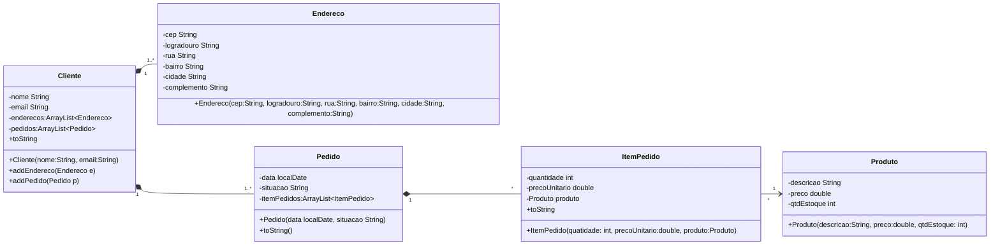

```mermaid
classDiagram
    direction LR
    
    class Cliente {
        -nome String
        -email String
        -enderecos:ArrayList~Endereco~
        -pedidos:ArrayList~Pedido~
        +Cliente(nome:String, email:String)
        +addEndereco(Endereco e)
        +addPedido(Pedido p)
        +toString
    }
    
    class Endereco {
        -cep String
        -logradouro String
        -rua String
        -bairro String
        -cidade String
        -complemento String
        +Endereco(cep:String, logradouro:String, rua:String, bairro:String, cidade:String, complemento:String)
    }
    class Produto {
        -descricao String
        -preco double
        -qtdEstoque int
        +Produto(descricao:String, preco:double, qtdEstoque: int)
    }
    class Pedido {
        -data localDate
        -situacao String
        -itemPedidos:ArrayList~ItemPedido~
        +Pedido(data localDate, situacao String)
        +toString()
    }
    class ItemPedido {
        -quantidade int
        -precoUnitario double
        -Produto produto
        +ItemPedido(quatidade: int, precoUnitario:double, produto:Produto)
        +toString
    }
    
    Cliente "1" *-- "1..*" Endereco
    Cliente "1" *-- "1..*" Pedido
    Pedido "1" *-- "*" ItemPedido
    ItemPedido "*"  --> "1" Produto

```