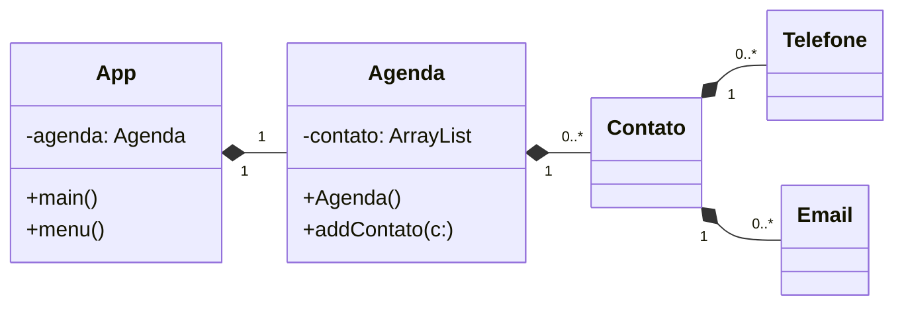

```mermaid

classDiagram
    direction LR
    class App {
        -agenda: Agenda
        +main()
        +menu()
        
    }
    
    class Agenda {
        -contato: ArrayList<Contato>
        +Agenda()
        +addContato(c:)
    }
    
    class Contato {
    }
    
    class Telefone {
        
    }
    class Email {
        
    }
    App "1" *-- "1" Agenda
   Agenda "1" *-- "0..*" Contato
   Contato "1" *-- "0..*" Telefone
   Contato "1" *-- "0..*" Email
``` 