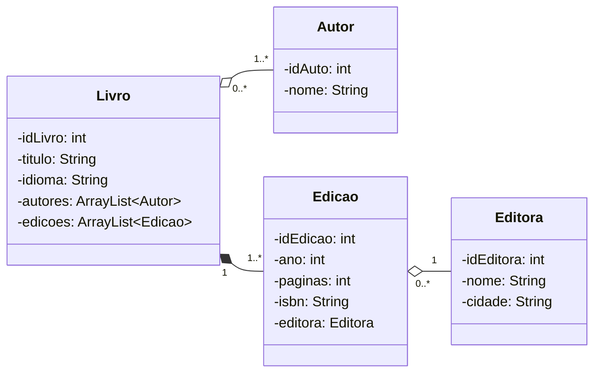

## Treinando em casa 

```mermaid


classDiagram
    direction LR

    
        class Autor {

           -idAuto: int
           -nome: String
        }
        
        class Editora {
            -idEditora: int
            -nome: String
            -cidade: String
        }
        
        class Edicao {
            -idEdicao: int
            -ano: int
            -paginas: int
            -isbn: String
            -editora: Editora 
        }
        
        class Livro {
            -idLivro: int
            -titulo: String
            -idioma: String
            -autores: ArrayList~Autor~
            -edicoes: ArrayList~Edicao~
        }
        
        Livro   "0..*" o-- "1..*" Autor
        Edicao  "0..*" o-- "1" Editora
        Livro "1" *-- "1..*"  Edicao


```